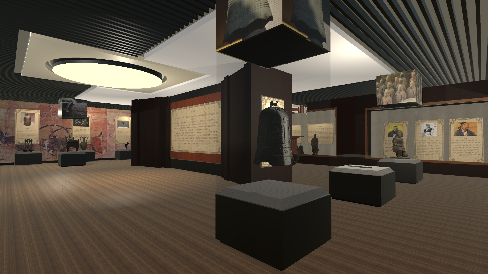
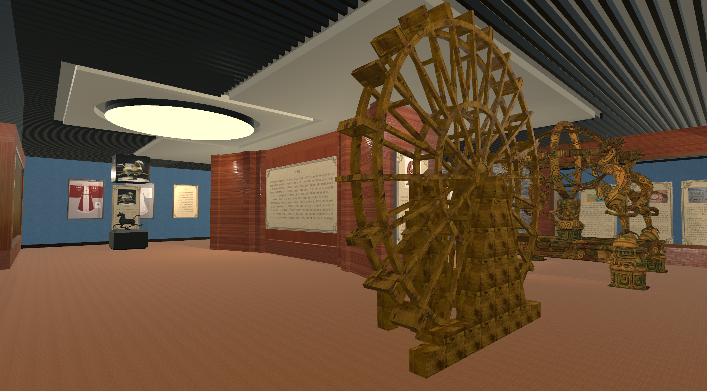
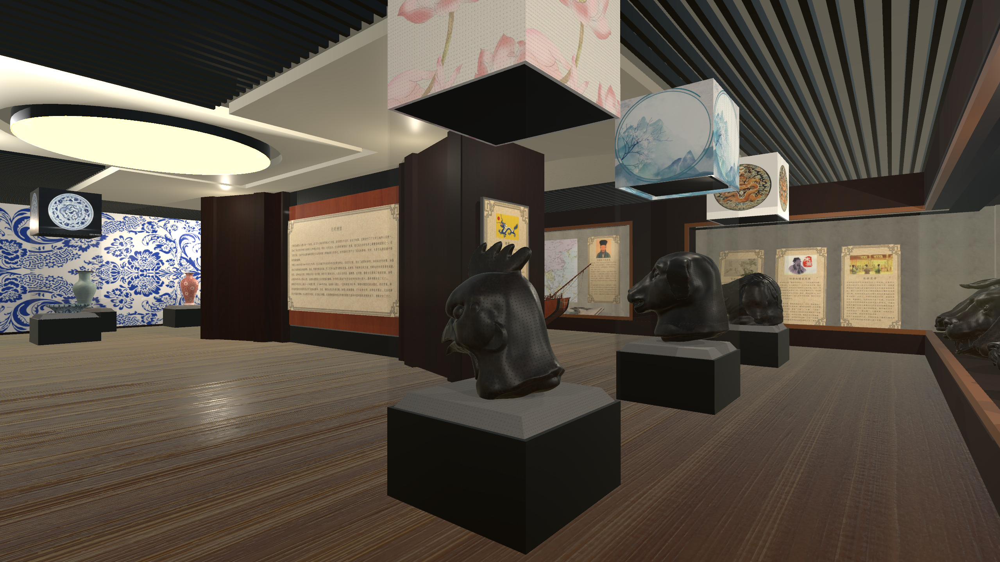

# Chinese Historical Evolution Museum
**An Interactive Virtual Museum Built with Unity3D**

> An undergraduate graduation project focusing on interactive virtual museums and cultural heritage visualization using Unity3D.

---

## Overview

This project is a **Unity3D-based interactive virtual museum** developed as my **undergraduate graduation project**.  
It presents the historical evolution of Chinese dynasties—from the Pre-Qin period to the late Qing dynasty—through **3D environments, cultural relic models, multimedia content, and first-person interactive exploration**.

The system explores how **virtual reality and real-time interaction technologies** can be applied to **history education and cultural heritage preservation**, providing users with an immersive and intuitive learning experience.

---

## Project Motivation

Traditional history education mainly relies on textbooks and static images, which often lack immersion and interactivity.  
With the rapid development of **real-time 3D engines and virtual reality technologies**, digital museums have become a promising medium for cultural transmission.

This project investigates:

- The application of Unity3D in virtual museum construction
- Interactive presentation of historical content
- Integration of 3D modeling, UI design, audio narration, and interaction systems

---

## demo
video:https://www.youtube.com/watch?v=VXj2J8SrU-c

asset packages and executable files：https://drive.google.com/drive/folders/1fcU8rQpgb6Nu1G4zs5BdnsEep1YmE6Up?usp=sharing

  
  

  
  

---

## System Structure

The virtual museum is organized **chronologically** and divided into **four main exhibition halls**:

1. Pre-Qin & Qin Dynasty Hall  
2. Han & Jin Dynasty Hall  
3. Sui, Tang & Song Dynasty Hall  
4. Yuan, Ming & Qing Dynasty Hall  

Each exhibition hall includes:

- 3D cultural relic models
- Thematic exhibition panels
- Interactive narration and multimedia content

---

## Key Features

- First-person roaming system with keyboard and mouse control  
- Interactive exhibits based on collision detection and raycasting  
- 3D cultural relic models created using Autodesk 3ds Max  
- Multimedia presentation combining text, images, audio, and animation  
- UI-based navigation and animated scene transitions  
- Audio narration generated using Microsoft Text-to-Speech (TTS) API  

---

## Controls & Interaction

- **Movement**: `W / A / S / D`
- **Camera**: Mouse movement
- **Interaction**: Left mouse button on UI elements
- **Mouse Control**: `ESC` to lock or release the cursor
- **Navigation**:
  - Back button at the top-left corner
  - Video skip button at the bottom-right corner
  - In specific sections, videos can be skipped and the application exited directly

---

## Technical Stack

- **Engine**: Unity 2022 LTS  
- **Language**: C#  
- **3D Modeling**: Autodesk 3ds Max  
- **UI & Graphics**: Adobe Photoshop  
- **Audio Processing**: Adobe Audition  
- **Speech Synthesis**: Microsoft Text-to-Speech (TTS) API  

---

## Implementation Highlights

- **Scene Construction**  
  Built using Unity’s native geometry and lighting system, followed by structured asset integration.

- **3D Modeling Pipeline**  
  Cultural relics were modeled in 3ds Max, UV-unwrapped, textured, and imported into Unity as FBX prefabs.

- **Interaction Design**  
  Implemented first-person navigation, raycasting-based exhibit interaction, UI animations, and scene transitions.

- **Performance Optimization**  
  Applied LOD techniques, occlusion culling, texture optimization, and draw-call reduction.

---

## Application Scenarios

- Auxiliary teaching tool for middle and high school history education  
- Digital exhibition support for physical museums  
- Interactive cultural experience for history enthusiasts  

---

## How to Run

1. Open the project using **Unity Hub**
2. Recommended Unity version: **Unity 2022.x LTS**
3. Open the main scene and press **Play**

> This repository contains **source code only**.  
> Large assets such as videos and high-polygon models may be excluded for repository size control.

---

## Related Work

This project is based on my undergraduate thesis:

*Design and Implementation of an Interactive Exhibition System for a “Historical Dynasty Evolution Museum” Based on Unity3D*  
Zhejiang Sci-Tech University, 2022

---

## Future Work

- Mobile platform support  
- Gamepad input mapping  
- VR device integration for enhanced immersion  
- Expanded historical content and higher-fidelity assets  

---

## Author

**Yuewei Jiang (蒋阅微)**  
Undergraduate Graduation Project, 2022
